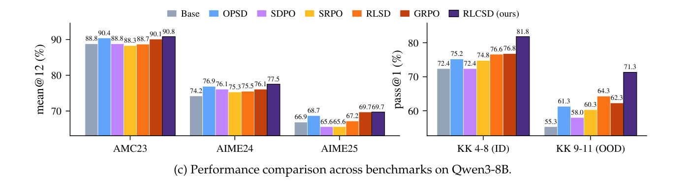
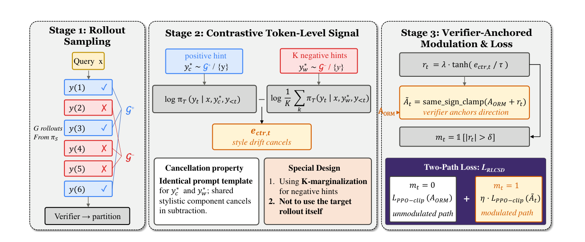
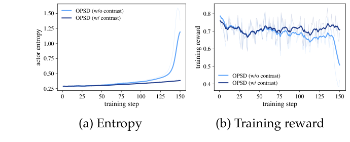
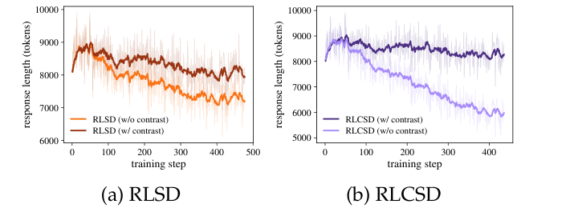

<div align="center">

# RLCSD: Reinforcement Learning with Contrastive On-Policy Self-Distillation

[](https://arxiv.org/abs/2606.11709)  [](https://huggingface.co/datasets/Leyiii/RLCSD)

</div>

On-policy self-distillation (OPSD) gives reasoning models dense, token-level
supervision by aligning a model's own distribution with the distribution it
produces under a privileged context (typically a verified solution). We show
that this distributional gap is dominated by **style tokens** rather than
**task-bearing tokens** — a pathology we call *privilege-induced style drift*,
which destabilizes training and collapses response length.

**RLCSD** removes this drift by **contrasting the teacher–student gap under a
correct hint against the gap under a *wrong* hint** produced under an identical
prompt template. The shared stylistic component cancels in the subtraction,
leaving a token-level signal that is more concentrated on task-bearing tokens.
We then integrate this signal into GRPO as a verifier-anchored modulation of
the outcome advantage, instead of a replacement for it. On Qwen3 (1.7B / 4B /
8B) and Olmo-3-7B-Think, across DeepMath (AMC23 / AIME24 / AIME25) and Knights
& Knaves, RLCSD **consistently outperforms GRPO and every prior OPSD baseline
we tested**, while keeping training dynamics stable where existing methods
either explode or collapse.

<p align="center">
  
</p>

## Method overview

<p align="center">
  
</p>

For each query we run three stages:

1. **Rollout sampling and partitioning.** Sample G rollouts from the student
   and split them into a correct set 𝒢⁺ and an incorrect set 𝒢⁻ using a
   rule-based verifier (binary reward).
2. **Contrastive token-level signal.** Draw a positive hint y\*<sub>c</sub> from
   𝒢⁺ and *K* negative hints {y\*<sub>w,k</sub>} from 𝒢⁻, wrap each in an
   identical "Reference Solution" template, and form

   ```
   e_ctr,t = log π_T(y_t | x, y*_c, y_<t) − log (1/K) Σ_k π_T(y_t | x, y*_{w,k}, y_<t)
   ```

   Two refinements matter: (i) **K-marginalize the negative branch** to stay
   robust against error-type mismatch between the target rollout and the
   sampled negative, and (ii) **exclude the target rollout from the hint
   pool** to avoid self-conditioning over-confidence.
3. **Verifier-anchored modulation & two-path loss.** Convert e<sub>ctr,t</sub>
   into a bounded modulation r<sub>t</sub> via a tanh squash, gate it with a
   threshold mask, and add it to A<sub>ORM</sub> under a sign-preserving clamp
   so the verifier always decides the update direction. Aggregate as a two-
   path PPO-style clipped loss with independent normalization for unmodulated
   and modulated token sets.

See the paper for derivations of (1)–(3) and ablations on each
design choice.

## Methods supported in this repo

Each YAML config selects a method via the `method:` key. Implementations live in
`third_party/verl/verl/trainer/ppo/core_algos.py` (loss) and
`src/self_distill_main.py` (RLCSD/ECTR rollout-side data path).

| Key          | Method                                                                                   | Reference                                                                  |
|--------------|------------------------------------------------------------------------------------------|----------------------------------------------------------------------------|
| `grpo`       | Group Relative Policy Optimization — verifier-only RLVR baseline.                        | Shao et al., 2024 — [arXiv:2402.03300](https://arxiv.org/abs/2402.03300)   |
| `opsd`       | On-policy self-distillation with dense forward-KL distillation and per-token KL clipping. | Zhao et al., 2026 — [arXiv:2601.18734](https://arxiv.org/abs/2601.18734) |
| `sdpo`       | Dense distillation using Jensen–Shannon divergence (mode-balancing variant of OPSD).     | Hübotter et al., 2026 — [arXiv:2601.20802](https://arxiv.org/abs/2601.20802) |
| `srpo`       | Sample-level routing: GRPO on correct rollouts, SDPO-style distillation on failed ones.  | Li et al., 2026 — [arXiv:2604.02288](https://arxiv.org/abs/2604.02288)     |
| `rlsd`       | Per-token sampled-token distillation gap used to *modulate* A<sub>ORM</sub>.             | Yang et al., 2026 — [arXiv:2604.03128](https://arxiv.org/abs/2604.03128)   |
| `rlcsd`      | **This work** — contrastive cancellation across symmetric positive/negative hints, then K-marginalized and integrated as a verifier-anchored A<sub>ORM</sub> modulation. | this repo                                                                  |
| `opsd_ectr`  | OPSD + the contrastive construction grafted onto its dense distillation target (plug-in study, §4.3 of the paper). | this repo                                                                  |
| `rlsd_ectr`  | RLSD + the contrastive construction grafted onto its scalar modulation (plug-in study, §4.3 of the paper). | this repo                                                                  |

The two `_ectr` variants are **not new training methods on their own**; they
exist to show that the contrastive principle behind RLCSD is general — see
[Contrastive hints as a plug-in component](#contrastive-hints-as-a-plug-in-component)
below.

## Repo layout

```
src/
  self_distill_main.py     RLCSD / OPSD / SDPO / RLSD / SRPO trainer entry
  verl_main.py             Legacy non-verl trainer (kept for reference)
  losses.py                generalized_jsd_loss / sdpo_loss / rlsd_loss
  verl_reward.py           Custom reward function used by verl
  opsd_format.py           Prompt template + privileged-context wrapping
  data_utils.py / prompts.py / models.py
configs/
  math_deepmath/           {model}_{algo}.yaml  (4 models × 6 algos + 4B-only ectr)
  logic_kk/                same layout
scripts/
  _run_verl.sh             Launcher: reads a YAML and runs the right entry
  math_deepmath/run_*.sh   Per-config shims
  logic_kk/run_*.sh
  download_data.py         Pull train/eval parquets from HuggingFace
third_party/verl/          Vendored verl with the RLCSD policy losses registered
assets/                    Figures from the paper used in this README
requirements.txt
```

## Install

```bash
# Recommended: a fresh Python 3.10–3.12 env
pip install -r requirements.txt
```

A few practical notes:

- `requirements.txt` pins `torch>=2.5.0,<2.10` to keep a CUDA 12 toolchain.
  torch 2.10+ defaults to CUDA 13 wheels which require a newer NVIDIA driver
  than CUDA 12.x systems ship. For an explicit CUDA match install from the
  PyTorch index:
  ```bash
  pip install "torch>=2.5.0,<2.10" --index-url https://download.pytorch.org/whl/cu126
  ```
- `flash-attn` builds against the installed torch — use
  `pip install flash-attn --no-build-isolation` if pip's build env can't find torch.
- `third_party/verl/` is added to `PYTHONPATH` automatically by `_run_verl.sh`.

## Data

Training and eval parquets live at
[Leyiii/RLCSD](https://huggingface.co/datasets/Leyiii/RLCSD). Pull everything
in one shot:

```bash
python scripts/download_data.py --all
```

This writes to `data/verl/<dataset>/{train,val}.parquet`. The launcher resolves
paths under that root.

| Dataset                              | Used by                            |
|--------------------------------------|------------------------------------|
| `deepmath_filtered_level5_7`         | Qwen3-1.7B (math train)            |
| `deepmath_filtered_level6_8`         | Qwen3-4B (math train)              |
| `deepmath_filtered_level7_10`        | Qwen3-8B + Olmo3-7B (math train)   |
| `amc23+aime24+aime25`                | math eval                          |
| `kk_4to8`                            | logic train (Knights & Knaves 4–8) |
| `kk_4to8_test+kk_9+kk_10+kk_11`      | logic eval (ID 4–8 + OOD 9–11)     |

Training data subsets come from filtering
[DeepMath-103K](https://huggingface.co/datasets/zwhe99/DeepMath-103K)
([He et al., 2025](https://arxiv.org/abs/2504.11456)) by difficulty band.
The Knights & Knaves generator follows
[Logic-RL](https://arxiv.org/abs/2502.14768) (Xie et al., 2025).

## Run

```bash
# RLCSD on Qwen3-4B, math reasoning
bash scripts/math_deepmath/run_qwen3_4b_rlcsd.sh

# SDPO baseline on Olmo3-7B-Think, logic puzzles
bash scripts/logic_kk/run_olmo3_7b_think_sdpo.sh
```

Each shim is a one-liner that forwards a config to `scripts/_run_verl.sh`. To
override individual hyperparameters, append Hydra-style overrides:

```bash
bash scripts/math_deepmath/run_qwen3_4b_rlcsd.sh learning_rate=2e-6 group_size=16
```

The launcher auto-detects `n_gpus_per_node` from the runtime environment when
the config omits it, and uses it with `vllm_tensor_parallel_size` to size rollout
batches. Override it explicitly on constrained nodes, e.g. `n_gpus_per_node=2`.

Common environment overrides:

- `HF_ENDPOINT` — e.g. `https://hf-mirror.com` for a HuggingFace mirror
- `CUDA_HOME` — defaults to `/usr/local/cuda`
- `VLLM_ATTENTION_BACKEND` — defaults to `FLASH_ATTN` to avoid vLLM
  auto-selecting FlashInfer on Blackwell GPUs; set `vllm_attention_backend=None`
  on the launcher command line to let vLLM choose automatically.

Training logs are local by default. Each run writes TensorBoard events under
`outputs/<project>/<experiment>/<timestamp>/tensorboard_log/` and scalar JSONL
metrics to `metrics.jsonl` in the same run directory. To inspect all local
runs:

```bash
tensorboard --logdir outputs --host 127.0.0.1 --port 6006
```

## Results

### Main results across model scales

RLCSD attains the strongest average performance in every model block and wins
most individual benchmarks across Qwen3 scales and Olmo-3-7B. The gains over the
Base model average **+4.3** (math) and **+10.9** (logic) at 1.7B; **+2.5** /
**+6.8** at 4B; **+2.7** / **+14.4** at 8B; and **+1.8** / **+9.9** on
Olmo-3-7B. The advantage is especially pronounced on the OOD Knights & Knaves
splits (**+21.0** on 11-role at 8B; **+13.0** on 11-role with Olmo-3-7B),
suggesting the cleaned token-level signal improves generalization rather than
just fitting the training task difficulty.

| Model       | Method          | AMC23 | AIME24 | AIME25 | Math Avg.       | KK 4–8 | KK 9 | KK 10 | KK 11 | Logic Avg.      |
|-------------|-----------------|------:|-------:|-------:|----------------:|-------:|-----:|------:|------:|----------------:|
| Qwen3-1.7B  | Base            | 74.1  | 48.3   | 33.3   | 51.9            | 63.2   | 53.0 | 43.0  | 31.0  | 47.6            |
|             | GRPO            | 76.6  | 51.6   | 37.2   | 55.1            | 67.4   | 59.0 | 52.0  | 34.0  | 53.1            |
|             | OPSD            | 76.3  | 50.8   | 37.7   | 54.9            | 64.4   | 55.0 | 52.0  | 32.0  | 50.9            |
|             | SDPO            | 72.9  | 42.2   | 33.6   | 49.6            | 67.4   | 61.0 | 54.0  | 30.0  | 53.1            |
|             | SRPO            | 73.2  | 43.6   | 34.4   | 50.4            | 64.4   | 58.0 | 47.0  | 33.0  | 50.6            |
|             | RLSD            | 73.9  | 46.1   | 36.9   | 52.3            | 66.8   | 59.0 | 50.0  | 35.0  | 52.7            |
|             | **RLCSD (ours)**| **77.2** | **53.1** | **38.3** | **56.2** (+4.3) | **70.0** | **63.0** | **63.0** | **38.0** | **58.5** (+10.9) |
| Qwen3-4B    | Base            | 88.6  | 72.5   | 65.3   | 75.5            | 73.2   | 67.0 | 58.0  | 42.0  | 60.1            |
|             | GRPO            | 89.1  | **75.8** | 66.1   | 77.0            | 75.4   | 71.0 | 61.0  | 45.0  | 63.1            |
|             | OPSD            | 89.4  | 74.2   | 67.5   | 77.0            | 73.4   | 71.0 | 62.0  | 42.0  | 62.1            |
|             | SDPO            | 88.3  | 68.3   | 64.4   | 73.7            | 74.4   | 72.0 | 62.0  | 45.0  | 63.4            |
|             | SRPO            | 87.9  | 71.4   | 64.7   | 74.7            | 75.0   | 71.0 | 61.0  | 45.0  | 63.0            |
|             | RLSD            | 86.9  | 71.2   | 66.9   | 75.0            | 76.8   | 72.0 | 63.0  | 48.0  | 65.0            |
|             | **RLCSD (ours)**| **90.1** | 74.4 | **69.4** | **78.0** (+2.5) | **78.6** | **73.0** | **66.0** | **50.0** | **66.9** (+6.8) |
| Qwen3-8B    | Base            | 88.8  | 74.2   | 66.9   | 76.6            | 72.4   | 67.0 | 55.0  | 44.0  | 59.6            |
|             | GRPO            | 90.1  | 76.1   | **69.7** | 78.6          | 76.8   | 75.0 | 63.0  | 49.0  | 66.0            |
|             | OPSD            | 90.4  | 76.9   | 68.7   | 78.7            | 75.2   | 74.0 | 61.0  | 49.0  | 64.8            |
|             | SDPO            | 88.8  | 76.1   | 65.6   | 76.8            | 72.4   | 72.0 | 56.0  | 46.0  | 61.6            |
|             | SRPO            | 88.3  | 75.3   | 65.6   | 76.4            | 74.8   | 72.0 | 60.0  | 49.0  | 64.0            |
|             | RLSD            | 88.7  | 75.5   | 67.2   | 77.1            | 76.6   | 77.0 | 64.0  | 52.0  | 67.4            |
|             | **RLCSD (ours)**| **90.8** | **77.5** | **69.7** | **79.3** (+2.7) | **81.8** | **79.0** | **70.0** | **65.0** | **74.0** (+14.4) |
| Olmo-3-7B   | Base            | 91.2  | 73.9   | 66.9   | 77.3            | 70.6   | 64.0 | 55.0  | 35.0  | 56.2            |
|             | GRPO            | 92.4  | 75.8   | **68.9** | 79.0          | 73.8   | 69.0 | 63.0  | 39.0  | 61.2            |
|             | OPSD            | 92.2  | 75.6   | 66.9   | 78.2            | 72.4   | 69.0 | 62.0  | 38.0  | 60.4            |
|             | SDPO            | 91.6  | 74.2   | 67.4   | 77.7            | 73.2   | 67.0 | 59.0  | 46.0  | 61.3            |
|             | SRPO            | 92.1  | 75.0   | 65.3   | 77.5            | 73.2   | 68.0 | 61.0  | 40.0  | 60.6            |
|             | RLSD            | 92.6  | 74.7   | 66.9   | 78.1            | 73.8   | 65.0 | 61.0  | 38.0  | 59.4            |
|             | **RLCSD (ours)**| **92.7** | **76.1** | 68.6 | **79.1** (+1.8) | **75.4** | **76.0** | **65.0** | **48.0** | **66.1** (+9.9) |

Math is reported as **mean@12**; Knights & Knaves as **pass@1**. KK 4–8 is the
in-distribution test set; 9 / 10 / 11 are out-of-distribution role counts.

### Training stability

Existing OPSD methods exhibit two characteristic failure modes:

- **Entropy explosion → training collapse.** OPSD, SDPO, and SRPO produce
  rapidly growing actor entropy that destabilizes optimization and manifests as
  abrupt response-length blow-up and sharp drops in reward and validation
  accuracy.
- **Premature length shrinkage.** RLSD steadily decreases response length on
  math, limiting late-stage performance on long-horizon problems.

RLCSD keeps both entropy and response length stable throughout training while
achieving stronger final validation performance:

<p align="center">
  
</p>

### Contrastive hints as a plug-in component

The contrastive construction is not specific to RLCSD. Applying it on top of
two representative methods from different families — OPSD (dense distillation)
and RLSD (advantage modulation) — improves **every** method on nearly every
metric.

Concretely, for each method we vary only the source of the privileged signal
and hold everything else fixed:

1. **Dataset CoT** — privileged context is the ground-truth solution from the
   dataset (the original setting in each method's paper).
2. **Own correct rollout** — privileged context is a correct rollout sampled
   by the model itself from the same group.
3. **Own rollout + contrast** — the contrastive construction (correct rollout
   vs. incorrect sibling rollout). This is what `*_ectr` and `rlcsd` use.

Settings (1) and (2) perform essentially the same across all three methods —
switching the *source* of the one-sided hint barely matters. Setting (3) is
the one that wins. Δ below is the **gain of (3) over the better of (1) and
(2)**, averaged across benchmarks (Math = AMC23 + AIME24 + AIME25 mean@12,
KK = 4–8 + 9 + 10 + 11 pass@1, Qwen3-4B):

|  Method | Δ (Math avg) | Δ (KK avg) |
|---------|-------------:|-----------:|
| OPSD    | **+0.2**     | **+2.3**   |
| RLSD    | **+2.2**     | **+1.0**   |
| RLCSD   | **+3.0**     | **+5.4**   |

**`opsd_ectr` — OPSD + contrastive token-level signal.** Without contrast,
OPSD's actor entropy explodes in the late stage (the failure mode above);
adding the contrastive hint keeps entropy bounded and yields a stable training
reward.

<p align="center">
  
</p>

**`rlsd_ectr` — RLSD + contrastive evidence ratio.** The contrastive signal
mitigates the length collapse seen in vanilla RLSD on math (left panel below).
The right panel is an **RLCSD ablation**: removing the contrast from RLCSD
reproduces the same length-collapse pathology, confirming that the contrastive
construction is what keeps RLCSD's reasoning traces from shrinking.

<p align="center">
  
</p>

These plug-in results are reported only on Qwen3-4B in the paper, and only
those configs ship here (`configs/{math_deepmath,logic_kk}/qwen3_4b_opsd_ectr.yaml`
and `qwen3_4b_rlsd_ectr.yaml`).

## Built on verl

The vendored fork under `third_party/verl/` is based on
[verl](https://github.com/volcengine/verl) ([Sheng et al., 2024](https://arxiv.org/abs/2409.19256)).
RLCSD-specific extensions live in:

- `third_party/verl/verl/trainer/ppo/core_algos.py` — new policy losses
  registered via `@register_policy_loss("rlcsd" | "opsd_ectr" | "rlsd_ectr")`
- `third_party/verl/verl/workers/{actor,utils}/` — minor plumbing for the
  positive/negative teacher batches required by the RLCSD data path

## Citation

If you use this code or the released RLCSD method, please cite:

```bibtex
@article{pan2026rlcsd,
  title={RLCSD: Reinforcement Learning with Contrastive On-Policy Self-Distillation},
  author={Pan, Leyi and Tao, Shuchang and Zhai, Yunpeng and Zhang, Lingzhe and Liu, Zhaoyang and Ding, Bolin and Liu, Aiwei and Wen, Lijie},
  journal={arXiv preprint arXiv:2606.11709},
  year={2026}
}
```
